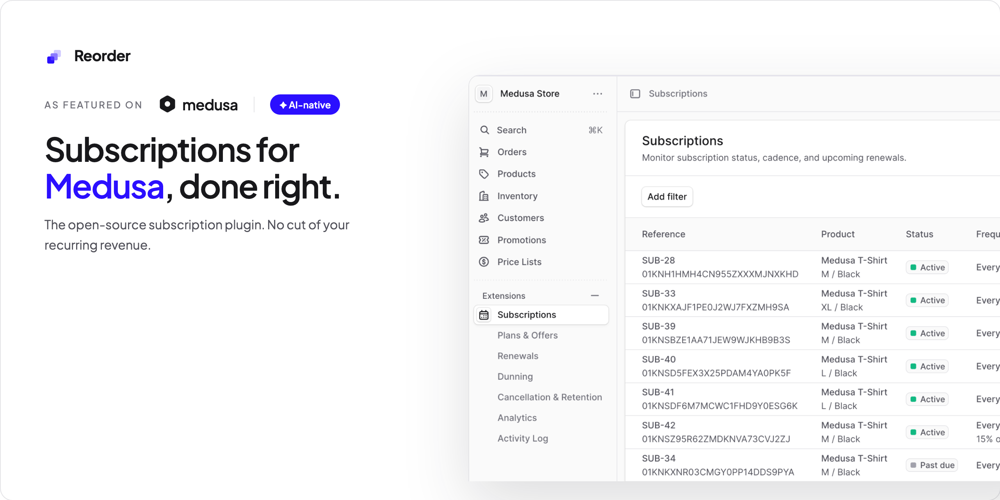
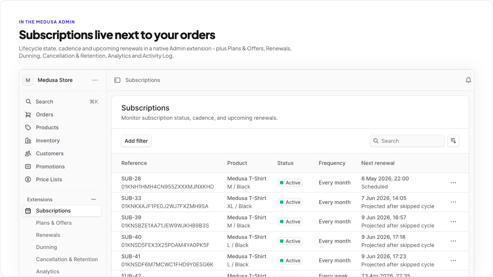
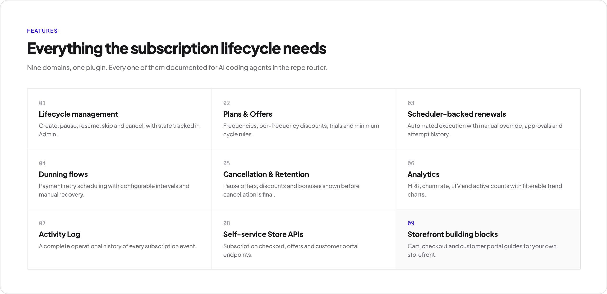
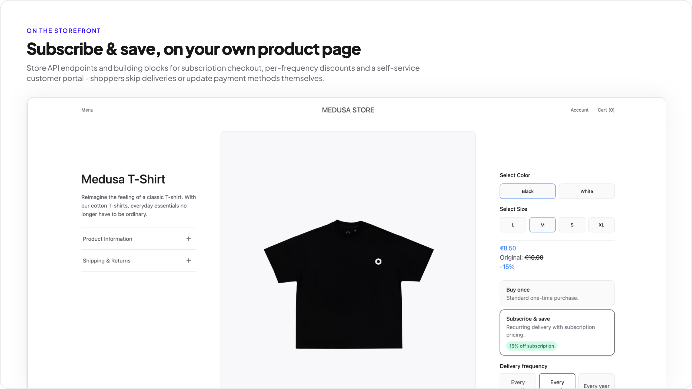
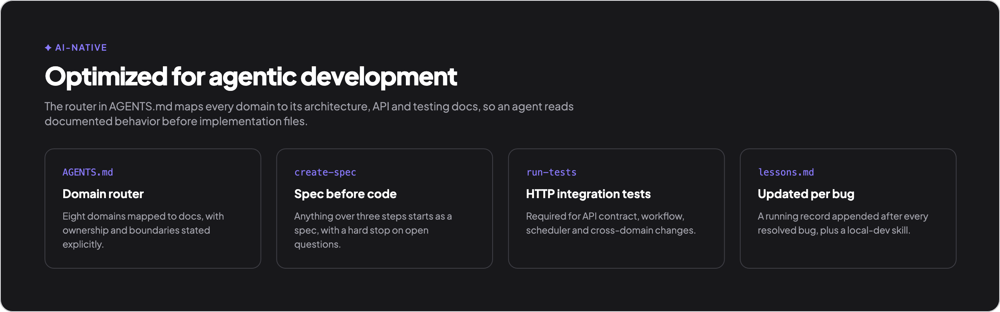

<div align="center">
    
</div>

<h1 align="center">Open-source subscription plugin built on standard Medusa primitives</h1>

<div align="center">
  <a href="https://medusajs.com/blog/reorder">
    
  </a>
  <a href="https://github.com/reorder-js/reorder?tab=MIT-1-ov-file">
    
  </a>
  <a href="https://github.com/reorder-js/reorder/issues">
    
  </a>
  <a href="https://www.reorderjs.com/get-started">
    
  </a>
</div>

&nbsp;

<div align="center">
  <a href="https://medusajs.com/blog/reorder">
    
  </a>
</div>

&nbsp;

<div align="center">
  <a href="https://www.reorderjs.com">Website</a> &nbsp;·&nbsp;
  <a href="https://docs.reorderjs.com">Documentation</a> &nbsp;·&nbsp;
  <a href="https://www.youtube.com/watch?v=KY43_6Q3560">Video Demo</a>
</div>

&nbsp;

## Why Reorder?

- **Native Medusa plugin** — built entirely on Medusa modules, workflows, and Admin UI extensions. No second source of truth, no external subscription platform to sync with.
- **Open-source, MIT licensed** — no revenue cut, no per-transaction fees, no vendor lock-in.
- **AI-native** — every domain is mapped in `AGENTS.md`, documented with specs, and covered by HTTP integration tests. Designed for agentic development from day one.
- **Officially featured by Medusa** — recognized by the Medusa team as the reference example of how a Medusa plugin should be built.
- **Production-ready** — Roastloop launched coffee subscriptions in 7 days using Reorder. [See the full story →](https://medusajs.com/blog/reorder)

&nbsp;

<div align="center">
  
</div>

&nbsp;

## What is Reorder?

`Reorder` is an open source Medusa subscription plugin.

It adds recurring commerce capabilities to a Medusa store, including subscriptions, plans and offers, renewals, dunning, cancellation and retention flows, activity logs, and analytics.

`Reorder` is built as a Medusa plugin with Medusa modules, workflow-backed mutations, Admin API routes, scheduled jobs, and Admin UI extensions.

&nbsp;

## What it includes

- **Subscriptions** — Create, pause, resume, skip, and cancel subscriptions, with full lifecycle state tracked in the Admin.
- **Plans & Offers** — Configure frequencies, per-frequency discounts, trials, and minimum cycle rules per plan.
- **Renewals** — Scheduler-backed renewal execution with manual override, approval queues, and full attempt history.
- **Dunning** — Payment retry scheduling with configurable intervals and manual recovery tooling.
- **Cancellation & Retention** — Pause offers, discounts, and bonuses shown to subscribers before cancellation is final.
- **Activity Log** — A complete operational history of every subscription event, accessible in the Admin.
- **Analytics** — MRR, churn rate, LTV, and active subscription counts with filterable trend charts.
- **Self-service Store APIs** — Subscription checkout, offer selection, and customer portal endpoints for your storefront.
- **Storefront building blocks** — Cart, checkout, and customer portal integration guides for your own frontend.

&nbsp;

<div align="center">
  
</div>

&nbsp;

<div align="center">
  
</div>

&nbsp;

## AI-native

Every domain in `Reorder` is mapped in `AGENTS.md` — linking architecture, API contracts, workflow docs, and integration tests so an AI agent reads documented behavior before touching implementation files.

<div align="center">
  
</div>

&nbsp;

## Medusa Cloud compatible

`Reorder` is compatible with Medusa Cloud. No self-hosting required — deploy your Medusa project to Medusa Cloud and install the plugin as you would locally.

&nbsp;

## Current scope

`Reorder` currently focuses on recurring commerce operations managed from the Medusa Admin.

Today, the plugin provides strong Admin coverage across the implemented domains. Customer self-service flows will be introduced in the near future as a `Reorder Subscription Starter`.

&nbsp;

## Installation

`Reorder` is meant to be installed into an existing Medusa project.

### 1. Install the plugin

With `npm`:

```bash
npm install @reorderjs/reorder
```

With `yarn`:

```bash
yarn add @reorderjs/reorder
```

### 2. Add the plugin to `medusa-config.ts`

```ts
plugins: [
  // other plugins
  {
    resolve: "@reorderjs/reorder",
    options: {},
  },
]
```

### 3. Run Migrations

With `npm`:

```bash
npx medusa db:migrate
```

With `yarn`:

```bash
yarn medusa db:migrate
```

### 4. Start your Medusa app

After adding the plugin, run your normal Medusa setup flow in your store project.

&nbsp;

## Local development

If you want to work on the plugin itself locally:

### 1. Clone the repository

```bash
git clone https://github.com/reorder-js/reorder.git
cd reorder
```

### 2. Install dependencies

```bash
yarn install
```

### 3. Publish the local plugin

```bash
yarn medusa plugin:publish
```

### 4. Add the plugin in your Medusa store

```bash
yarn medusa plugin:add reorder
```

### 5. Add the plugin configuration to `medusa-config.ts`

```ts
plugins: [
  // other plugins
  {
    resolve: "reorder",
    options: {},
  },
]
```

### 6. Install store dependencies

```bash
yarn install
```

### 7. Start your Medusa store

```bash
yarn dev
```

&nbsp;

## Requirements

- Minimum: Medusa `2.3+`
- Recommended: compatible with `@medusajs/medusa >= 2.4.0`

&nbsp;

## Architecture

`Reorder` is organized around Medusa-native building blocks:

- domain modules for subscription data and operational records
- workflows for business mutations and orchestration
- Admin API routes for plugin operations
- Admin UI extensions for management flows
- scheduled jobs for renewals, dunning, and analytics processing

&nbsp;

## Community & Support

- **GitHub Issues** — bug reports and feature requests: [github.com/reorder-js/reorder/issues](https://github.com/reorder-js/reorder/issues)
- **GitHub Discussions** — questions, ideas, and general help: [github.com/reorder-js/reorder/discussions](https://github.com/reorder-js/reorder/discussions)
- **Contact** — reach the author directly at [reorderjs.com/get-started](https://www.reorderjs.com/get-started)

&nbsp;

## Documentation

Project documentation lives in `docs/`.

Useful starting points:

- `docs/README.md`
- `docs/architecture/`
- `docs/api/`
- `docs/admin/`
- `docs/testing/`
- `docs/roadmap/implementation-plan.md`

&nbsp;

## Contributing

Issues and pull requests are welcome.

Before changing behavior:

- read the runtime docs in `docs/`
- keep implementation aligned with documented behavior
- follow Medusa best practices for modules, workflows, routes, and Admin UI extensions
